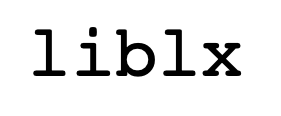

.. LIBLX API documentation master file, adapted from COPASI one created by
   sphinx-quickstart on Wed Apr 14 10:45:25 2021.
   You can adapt this file completely to your liking, but it should at least
   contain the root `toctree` directive.

Welcome to the LibLX API documentation
======================================

.. toctree::
   :maxdepth: 2
   :caption: Contents:

   quickstart/get-started
   quickstart/complete-windows-example
   quickstart/swig-windows   
   liblx/python-bindings
   examples/examples
   api

Indices and tables
==================

* :ref:`genindex`
* :ref:`modindex`
* :ref:`search`
